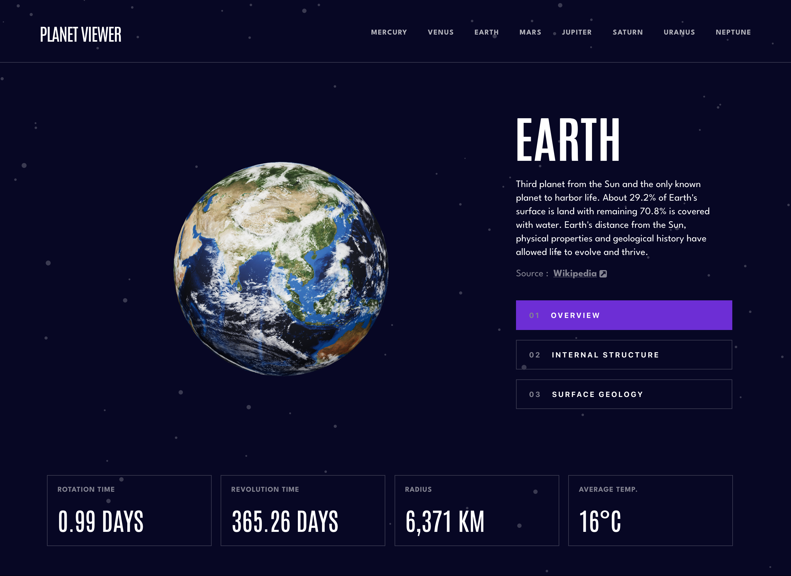

# Frontend Mentor - Planets fact site solution

This is a solution to the [Planets fact site challenge on Frontend Mentor](https://www.frontendmentor.io/challenges/planets-fact-site-gazqN8w_f). Frontend Mentor challenges help you improve your coding skills by building realistic projects.

## Table of contents

- [Overview](#overview)
  - [The challenge](#the-challenge)
  - [Screenshot](#screenshot)
  - [Links](#links)
  - [Built with](#built-with)
- [My process](#my-process)
  - [What I learned](#what-i-learned)
  - [Future development](#future-development)

## Overview

### The challenge

Users should be able to:

- Make the app fully responsive
- See hover states for all interactive elements on the page
- View each planet page and toggle between "Overview", "Internal Structure", and "Surface Geology"
- Themes for each planet

#### Added Features

- View each planet in 3D with the ability to rotate.
- View in augmented reality on iOS.

### 📸 Preview



### 🔗 Links

- Solution URL: [Solution](https://github.com/jkellerman/planet-viewer)
- Live Site URL: [Live](https://planetviewer.netlify.app)

### 🧰 Built with

- [React](https://reactjs.org/) - JS library
- [Styled Components](https://styled-components.com/) - For styles
- [Model-viewer](https://modelviewer.dev/) - 3D/AR Models
- [Framer-motion](https://www.framer.com/motion/) - For animations

## My process

I've always been fascinated by planets, so I was very excited to complete this challenge while also putting my own spin on it. I chose Styled Components to style my app because I've recently been styling my react applications this way and found it to be a much better developer experience when styling within the component you're working on. It also works really well when building each component across all breakpoints with a mobile-first workflow.

Along the way, there were some tricky styling challenges, one of which was the navigation. The long way would have been to write out each nth child pseudo element because each nav link had its own unique colour for pseudo elements, but I found a more elegant way (see below), which was to write a js function that iterates through the theme array I created and returns the colour based on the index. The function would then be called within the styled component.

```js
const getBackgroundColor = (i, colorsIndex) => {
  return `
    &:nth-child(${i + 1}n)::before{
      background: ${THEME[colorsIndex++].color};
    }
  `;
};

export const calculateBackgrounds = () => {
  let str = "";
  let colorsIndex = -1;
  for (let index = 0; index < THEME.length; index++) {
    colorsIndex++;
    if (colorsIndex === colorsIndex.length - 1) colorsIndex = 0;
    str += getBackgroundColor(index, colorsIndex);
  }
  return str;
};
```

I made a pages file in which I placed the components that would be shared by all routes. When switching routes, the tab needed to be reset to overview, which would have necessitated some prop drilling, so I used the Context API, which held state for the current tab. This would then allow me to **useContext** throughout the app when switching routes and conditionally rendering planet descriptions.

The models were actually quite simple to implement during development, but I ran into a few issues when switching paths. Between renders, the images for the planet would spill over into the next one. For example, if I am on Mars and then switch to Jupiter, the image of Mars would flash before Jupiter at Jupiter's size, which was very clunky. Fortunately, I was able to solve this by using animations to make the planet exit the viewport before the next planet entered, so framer motion came in handy here.

In production, I also discovered a problem with the header and main DOM elements duplicating themselves on first load. I had to go back and retrace my steps to figure out what was wrong. According to the tutorial I was following, I had implemented animated presence incorrectly on my routes. I had entered the routes key as location.key, but after some digging, I discovered that it should be changed to location.pathname, and the problem was solved.

### 🧑‍💻 Future development

In retrospect, there were a few things I would have done differently in terms of performance, but these are things I learned during the process and will continue to educate myself on in order to create better apps in the future. Models will always take a few seconds to load in reality, but there are a few solutions to improve the user experience. **Lazy loading** comes into play here. Rather than waiting for the models to fully load, I added a poster file that displays before the model is rendered, which is useful for showing the client something before the model has fully loaded if it takes too long.

Because there isn't a lot of information on the subject, I went in blindly rendering 3d models using framer motion animations. It works well if the client has fast internet; however, if they are on 3G or a slow connection, the models will take some time to load.

However, this has piqued my interest in how to make web apps more performant, such as reducing unused Javascript and the possibility of avoiding Styled Components to reduce main-thread work.
