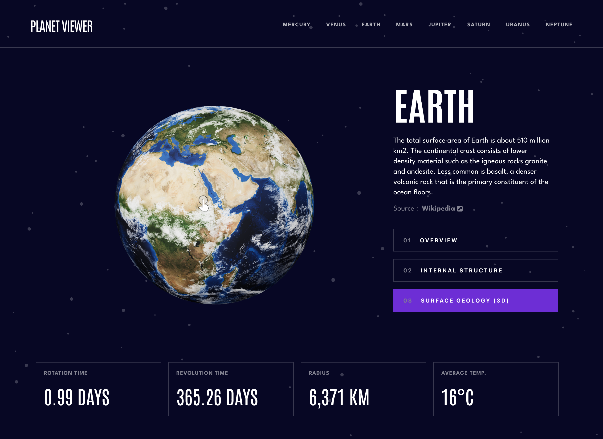

# Frontend Mentor - Planets fact site solution

This is a solution to the [Planets fact site challenge on Frontend Mentor](https://www.frontendmentor.io/challenges/planets-fact-site-gazqN8w_f). Frontend Mentor challenges help you improve your coding skills by building realistic projects.

## Table of contents

- [Overview](#overview)
  - [The challenge](#the-challenge)
  - [Previews](#previews)
  - [Links](#links)
  - [Built with](#built-with)
- [My process](#my-process)
  - [Update](#update)

## Overview

### The challenge

Users should be able to:

- View the optimal layout for the app depending on their device's screen size
- See hover states for all interactive elements on the page
- View each planet page and toggle between "Overview", "Internal Structure", and "Surface Geology"

#### Added Features

- View each planet in 3D with the ability to rotate.
- View in augmented reality on iOS.

### 📸&nbsp;Previews




### 🔗&nbsp;Links

- [Solution](https://github.com/jkellerman/planet-viewer)
- [Live Site](https://planetviewer.netlify.app)

### 🧰&nbsp;Built with

- [React](https://reactjs.org/) - JS library
- [Styled Components](https://styled-components.com/) - For styles
- [Model-viewer](https://modelviewer.dev/) - 3D/AR Models
- [Framer-motion](https://www.framer.com/motion/) - For animations

## 💭&nbsp;My process

I've always been fascinated by planets, so I was very excited to complete this challenge. I chose Styled Components to style my app because I've recently been styling my react applications this way and found it to be a much better developer experience when styling within the component you're working on. It also works really well when building each component across all breakpoints with a mobile-first workflow.

Along the way, there were some tricky styling challenges, one of which was the navigation. The long way would have been to write out each nth child pseudo element because each nav link had its own unique colour for pseudo elements, but I found a more elegant way (see below), which was to write a js function that iterates over the theme array I created and returns the colour based on the index. The function would then be called within the styled component.

```js
const getBackgroundColor = (i, colorsIndex) => {
  return `
    &:nth-child(${i + 1}n)::before{
      background: ${THEME[colorsIndex++].color};
    }
  `;
};

export const calculateBackgrounds = () => {
  let str = "";
  let colorsIndex = -1;
  for (let index = 0; index < THEME.length; index++) {
    colorsIndex++;
    if (colorsIndex === colorsIndex.length - 1) colorsIndex = 0;
    str += getBackgroundColor(index, colorsIndex);
  }
  return str;
};
```

I made a pages file in which I placed the components that would be shared by all routes. When switching routes, the tab needed to be reset to overview, which would have necessitated some prop drilling, so I used the Context API, which held state for the current tab. This would then allow me to `useContext` throughout the app when switching routes and conditionally rendering planet data, images and descriptions.

The models were actually quite simple to implement during development, but I ran into a few issues when switching paths with framer motion animations. At first, the images for the planet would spill over into the next one between route changes. For example, if I am on Mars and then switch to Jupiter, the image of Mars would flash before Jupiter comes in to the viewport, which looked very clunky. Fortunately, I was able to solve this by utilising the setTimeOut method, which allowed some time before currentTab sets to "overview". This resulted in a much smoother transition.

Models will always take a few seconds to load in reality, but there are a few solutions to improve the user experience. `Lazy loading` comes into play here. Rather than waiting for the models to fully load, I added a poster file that displays before the model is rendered, which is useful for showing the client something before the model has fully loaded if it takes too long. The Model-Viewer documentation also explains how to modify the default loading CSS properties. To make the rendering between planets much smoother, I removed the white background and progress bar.

### 🧑‍💻&nbsp;Update

Originally, I departed from the original design and simply used 3D models instead of images for the overview and structure tabs. The implementation worked fine, but if users have slow network speeds, it can be quite a poor user experience, so I added in the images provided, so the initial pageload and navigation between pages is much better.
