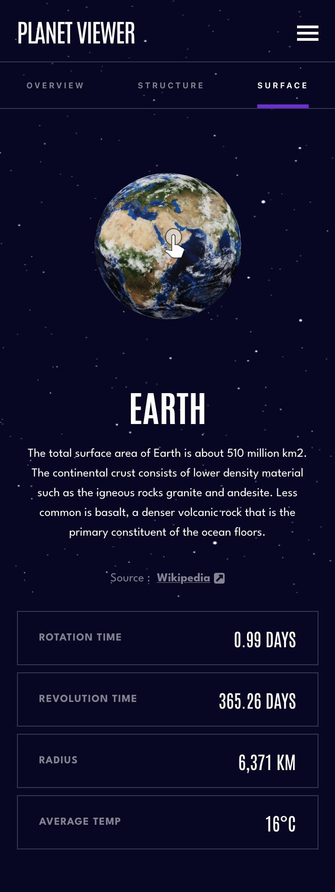
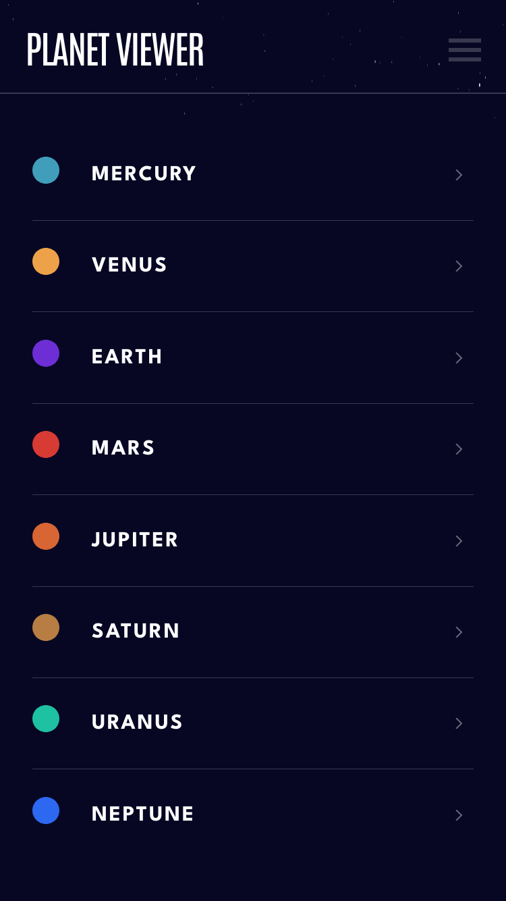
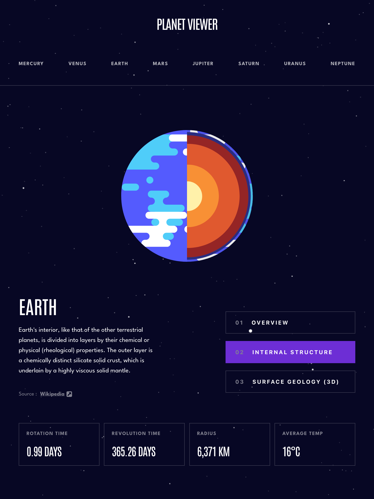
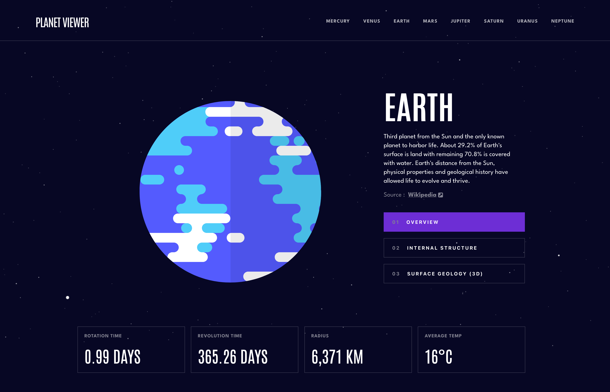

# Planet Viewer - Learn about the planets whilst interacting with them in 3D or AR

This is my solution, to the [Planets fact site challenge on Frontend Mentor](https://www.frontendmentor.io/challenges/planets-fact-site-gazqN8w_f), with some added features.

## Table of contents

- [Overview](#overview)
  - [The challenge](#the-challenge)
  - [Added features](#added-features)
  - [Previews](#previews)
  - [Links](#links)
  - [Built with](#built-with)
- [My process](#my-process)
- [Acknowledgements](#acknowledgements)

## Overview

### The challenge

Users should be able to:

- View the optimal layout for the app depending on their device's screen size
- See hover states for all interactive elements on the page
- View each planet page and toggle between "Overview", "Internal Structure", and "Surface Geology"

### Added features

Users should be able to:

- Interact with each planet in 3D.
- View each planet in augmented reality on iPhone or iPad.

### 📸&nbsp;Previews

#### mobile





#### tablet



#### desktop



### 🔗&nbsp;Links

- [Solution](https://github.com/jkellerman/planet-viewer)
- [Live Site](https://planetviewer.net)

### 🧰&nbsp;Built with

- [TypeScript](https://www.typescriptlang.org/)
- [React](https://reactjs.org/)
- [Styled Components](https://styled-components.com/)
- [Framer-motion](https://www.framer.com/motion/)
- [Model-viewer](https://modelviewer.dev/)

## 💭&nbsp;My process

I've always been fascinated by planets, so I was very excited to complete this project. I've been experimenting with Styled Components and found it to be enjoyable styling within the component you're working on. It also works really well when building each component across all breakpoints with a mobile-first workflow.

There were some tricky styling challenges along the way, one of which was the navigation. Because each nav link had its own unique colour for pseudo elements, the long way would have been to write out each nth child pseudo element, but I implemented a js function that iterates over the theme array I created and returns the colour based on the index. Within the styled component, the function would then be called.

```js
const getNavTheme = (i: number) => {
  return `
      &:nth-child(${i + 1}n)::before{
        background: ${PLANETS[i].theme};
      }
    `;
};

const calculateNavTheme = () => {
  let str = "";
  for (let i = 0; i < PLANETS.length; i++) {
    str += getNavTheme(i);
  }
  return str;
};
```

```css
    li {
      ${calculateNavTheme}
    }
```

I made a pages file in which I placed the components that would be shared by all routes. When switching routes, the tab needed to be reset to overview. I wanted to practice using the the Context API, so I chose to `useContext` to hold state for the current tab. This would then allow me to conditionally render planet data, images and descriptions when switching routes without implementing any prop drilling.

The models were actually quite simple to implement during development, but I ran into a few issues when switching paths with framer motion animations. At first, the images for the planet would spill over into the next one between route changes. For example, if I am on Mars and then switch to Jupiter, the image of Mars would flash before Jupiter comes in to the viewport, which looked very clunky. Fortunately, I was able to solve this by utilising the setTimeOut method, which allowed some time before currentTab sets to "overview". This resulted in a much smoother transition.

Models will always take a few seconds to load in reality, but there are a few solutions to improve the user experience. `Lazy loading` comes into play here. Rather than waiting for the models to fully load, I added a poster file that displays before the model is rendered, which is useful for showing the client something before the model has fully loaded if it takes too long. The Model-Viewer documentation also explains how to modify the default loading CSS properties. To make the rendering between planets much smoother, I removed the white background and progress bar.

## 🧑‍💻&nbsp;Acknowledgements

- [Starfield](https://codesandbox.io/s/5wwoqr3j24?file=/src/styles.css)
